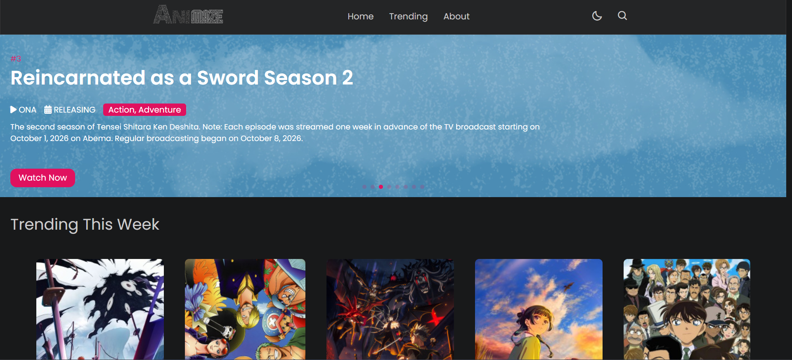
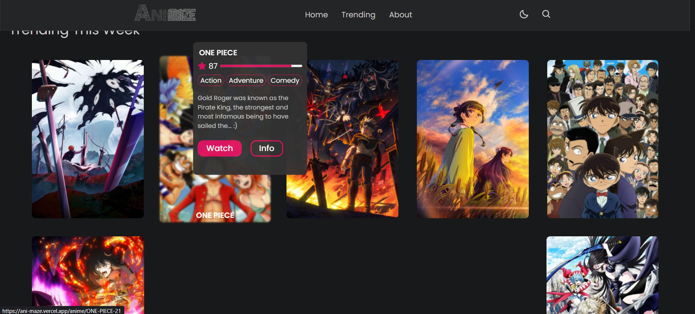
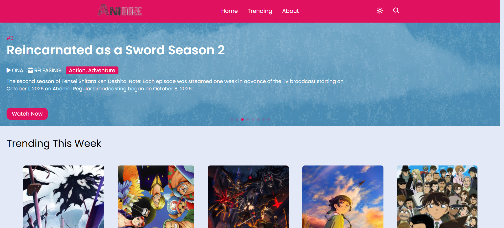

# 🎬 AniMaze

### Anime Discovery & Streaming Website

**AniMaze** is a full-stack anime website where users can discover anime, search for their favorite shows, view detailed information, and stream episodes with subtitles and SUB/DUB support.

The project was built from scratch to learn how a complete web application works — from the frontend and backend to APIs, data processing, and video streaming.

<p align="center">
  
</p>

<p align="center">
  <b>Discover • Search • Watch • Explore</b>
</p>

<p align="center">
  <a href="https://ani-maze.vercel.app">
    
  </a>
  <a href="https://github.com/kaustuklol/AniMaze">
    
  </a>
</p>

> ⚠️ **Note:** The original deployment was working when it was developed and deployed. Some streaming features may not work now because AniMaze depends on third-party APIs and streaming services that can change or become unavailable over time.

---

## 📸 Screenshots

### 🏠 Home Page

The homepage displays featured anime, trending titles, anime information, and quick access to different sections.

<p align="center">
  
</p>

---

### 🔥 Trending Anime

Users can explore trending anime and quickly see ratings, genres, descriptions, and options to watch or view more information.

<p align="center">
  
</p>

---

### 📖 Anime Details

Every anime has its own detailed page showing information such as:

- Anime title
- Japanese title
- Status
- Duration
- Studio
- Score
- Genres
- Synopsis
- Poster
- Background

<p align="center">
  
</p>

---

### ☀️ Light Mode

AniMaze also includes a theme switch so users can switch between dark and light modes.

<p align="center">
  
</p>

---

## ✨ Features

- 🔥 Trending anime
- 🔎 Search for anime
- 📖 Detailed anime information
- 🎬 Episode listing
- ▶️ Online video streaming
- 🎙️ SUB / DUB support
- 📝 Subtitle support
- ⏭️ Next episode navigation
- 🎯 Anime recommendations
- 🌙 Dark / Light mode
- 📱 Responsive design
- ⚡ Asynchronous API requests

---

## 🛠️ Tech Stack

### Frontend

- HTML
- CSS
- JavaScript
- Tailwind CSS

### Backend

- Python
- FastAPI
- Jinja2

### APIs

- AniList GraphQL API
- Consumet API

### Video

- HLS.js
- Plyr

### Deployment

- Vercel

---

## 🧩 How AniMaze Works

AniMaze connects multiple services to create the complete experience.

```text
                         AniMaze
                            │
              ┌─────────────┴─────────────┐
              │                           │
           AniList                    Consumet
              │                           │
      Anime Information              Episodes
      Ratings                         Sources
      Genres                          Streaming
      Studios
              │                           │
              └─────────────┬─────────────┘
                            │
                         FastAPI
                            │
                            ▼
                       AniMaze UI
                            │
                            ▼
                      HLS Video Player
                            │
                            ▼
                           User


```
### 👨‍💻 Developer

kaustuk

Built with ❤️, Python, JavaScript and a lot of debugging.

⭐ If you like the project, consider giving it a star!

### 📌 Note

AniMaze is an educational project. It does not host anime content itself and relies on external services for anime information and streaming data.
